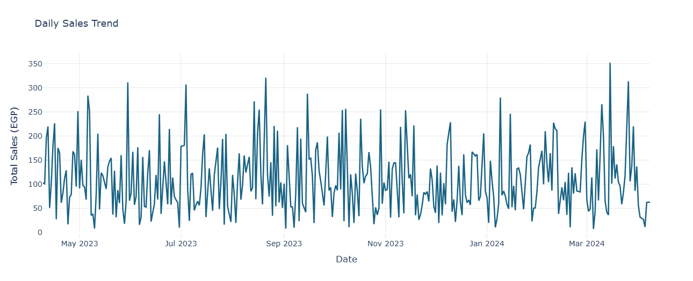

# QA & Product Support Portfolio: POS System Testing Project

    

## Project Overview
This repository serves as a professional portfolio demonstrating practical skills in Quality Assurance (QA) and Product Support for Point of Sale (POS) systems in the Food & Beverage (F&B) industry. Using a simulated restaurant transaction dataset from Kaggle, the project covers manual testing, bug tracking, data validation queries, API simulation, and UI/UX visualization.

It showcases hands-on experience in SaaS environments, focusing on testing product features, validating user journeys, ensuring data integrity, and improving overall product reliability-core responsibilities in modern QA and product support roles.

**Key Skills Demonstrated:**
- Manual and regression testing with structured test cases and checklists.
- Bug logging and clear documentation (reproduction steps, severity, expected vs. actual).
- SQL-like queries using Pandas for sales aggregation and inventory validation.
- API testing simulation (mimicking Postman with Requests).
- Interactive data visualization for UI/UX review (sales trends using Plotly).
- Familiarity with Agile/Scrum workflows and F&B tech domain (POS/ERP systems).

## Dataset Source
- **Kaggle Dataset**: https://www.kaggle.com/datasets/ganeshabbitota/pos-data-simulated-restaurant-data (simulated POS transactions with columns like Timestamp, Customer_ID, Item_Name, Quantity, Price_Per_Item, Total_Price).
- Purpose: Replicates real-world F&B POS data to test common scenarios such as negative pricing, duplicates, and inventory issues.

## Repository Structure
- `.gitignore`: Standard Git ignore rules.
- `LICENSE`: MIT License for open-source usage.
- `README.md`: This file-project overview and documentation.
- `bug_report.md`: Sample bug report with title, severity, steps to reproduce, and fix suggestions.
- `daily_sales_trend.png`: Static screenshot of the interactive daily sales trend chart.
- `qa-product-support-project-for-pos-systems.ipynb`: Main Jupyter Notebook with all code, tests, queries, API simulations, and interactive visualizations (best viewed on Kaggle or Jupyter).

## How to Run the Project
1. Clone the repository: `git clone https://github.com/your-username/your-repo-name.git`.
2. Open `qa-product-support-project-for-pos-systems.ipynb` in Jupyter Notebook, Google Colab, or Kaggle.
3. Install required libraries (if needed): `pip install pandas matplotlib plotly requests`.
4. Run all cells to execute tests, queries, and visualizations.
   - Note: On Kaggle, add the dataset directly for seamless loading.
5. View the interactive Plotly chart (hover for details on daily sales).

## Sample Results and Outputs
- **Test Cases**: All passed (no negative prices, total sales ~37,274 EGP, no duplicates).
- **SQL Queries**: Example-Total sales after 2024-01-01: ~10,099 EGP; Inventory grouped by item with no zero quantities.
- **Bug Report**: Simulated high-severity bug example in `bug_report.md`.
- **Visualization**: Professional interactive daily sales trend (blue styling, gridlines, hover tooltips). Static preview:  
  

## Relevance to QA Roles in F&B Tech
This portfolio demonstrates core competencies for QA and product support positions in the hospitality/tech sector:
- Testing features and user journeys across web, mobile, and POS environments.
- Clear bug reporting and regression testing for cross-team collaboration.
- Practical exposure to SQL, API testing tools, and Agile processes.
- Focus on product reliability and customer-facing improvements in SaaS platforms.

Feel free to fork or adapt the project for your own portfolio!

## Technologies Used
- **Languages**: Python
- **Libraries**: Pandas (data manipulation), Plotly (interactive charts), Requests (API simulation)
- **Tools**: Kaggle (dataset & notebook execution), GitHub (version control)

## Contributing
Contributions are welcome! Fork the repo and submit pull requests with improvements (e.g., additional test cases or basic automation).

---

*Project built with Python, Pandas, Plotly, and Kaggle. Last updated: January 2026. Licensed under MIT.*
